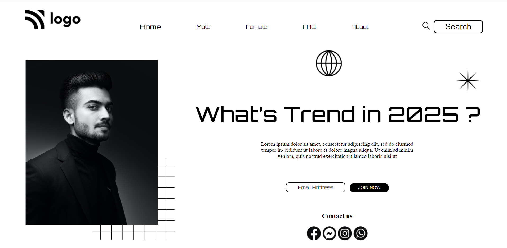

# HTML & CSS: Project-01

  

***

# Project-01: [Live Website Link](https://live-project-01.netlify.app/)

>## Learning From This Project

 - Learned to convert UI design into HTML & CSS webpage.
 - Learned to use CSS selectors to select the particular element.
 - Learned to use CSS positions such as absolute, relative.
 - Learned to use Flex to design the navbar.

